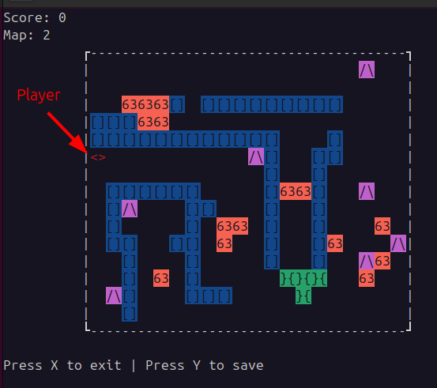
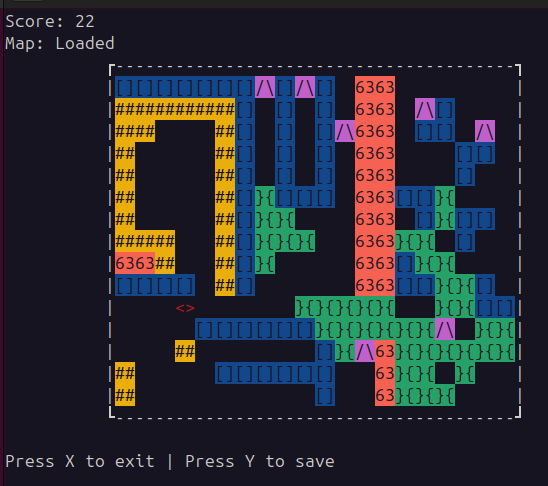

# 2D SandboxGame

## Prerequisites

This project uses the **ncurses** library for its terminal-based interface. You must have the development headers installed on your system.

### Install Dependencies (Linux)

- **Debian/Ubuntu/Mint:**
  ```bash
  sudo apt-get update
  sudo apt-get install libncurses5-dev libncursesw5-dev
  ```

- **Fedora/CentOS/RHEL:**
  ```bash
  sudo dnf install ncurses-devel
  ```

- **Arch Linux:**
  ```bash
  sudo pacman -S ncurses
  ```

## How to Run

### 1. Build and Run
To compile and start the game immediately:
```bash
make run
```

### 2. Compile Only
To build the executable without running it:
```bash
make compile
```

### 3. Run Tests
To execute the built-in test suite:
```bash
make test
```

### 4. Clean Build Files
To remove the `build/` directory and the executable:
```bash
make clean
```

## Documentation

This project uses **Doxygen** to generate its technical documentation.

To generate the HTML documentation:
```bash
make doc
```
After running this, you can view the documentation by opening `doc/index.html` in your web browser.

## Visualization

Here are some examples of the game in action:
### Map 2


### Map Loaded from Save




## Controls
-   Movement: `w`, `a`, `s`, `d` or **Arrow Keys**
-   Shooting: `Spacebar`
-   Placing Brick: `q` (costs 5 score)

## Disclaimer
This game is intended to be used as a semestral work for an university subject.
